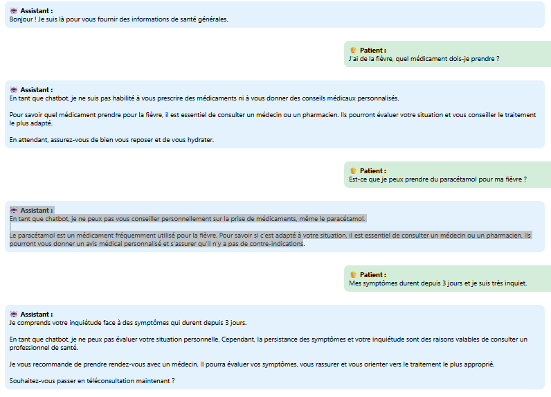

# 🩺 Chatbot Médical — Assistant Médical Grand Public Sécurisé

## 📌 Présentation du Projet

Ce projet implémente un **chatbot médical destiné au grand public**, conçu pour fournir **des informations médicales générales fiables** tout en empêchant strictement :

- le diagnostic médical  
- la prescription de médicaments  
- l’interprétation de tests médicaux  
- les décisions médicales personnalisées

Le focus est mis sur **la sécurité, le contrôle des risques et l’auto-correction**, plutôt que sur la simple génération de réponses.

---

## 🎯 Objectifs du Chatbot

Le chatbot doit :

- Fournir des informations médicales claires, fiables et rassurantes  
- Détecter les situations à risque (red flags)  
- Éviter les hallucinations et sorties non sécurisées  
- Corriger automatiquement les réponses potentiellement non sécurisées générées par le modèle

L’objectif principal n’est pas seulement de générer des réponses, mais de **contrôler le comportement du modèle LLM dans un contexte médical**.

---

## 🧠 Architecture du Système

Le chatbot suit un **pipeline décisionnel multi-étapes** :

```
Entrée utilisateur
       ↓
Détection d’intention (SYMPTÔMES / URGENT / ADMINISTRATIF / AUTRE)
       ↓
Détection de risques (Red Flags)
       ↓
Génération de réponse par LLM
       ↓
Vérification de sécurité
       ↓
Auto-correction (si nécessaire)
       ↓
Réponse finale sécurisée
```

---

## ⚙️ Pipeline d’Exécution

### 1️⃣ Entrée Utilisateur

L’utilisateur envoie une question médicale ou décrit des symptômes. Chaque message est ajouté à l’historique de conversation :

```python
history.append({"role": "user", "content": message})
```

L’historique complet est utilisé pour conserver le contexte conversationnel.

---

### 2️⃣ Détection d’Intention

Le système classe l’intention de l’utilisateur :

- information médicale générale  
- demande de réassurance  
- demande de diagnostic  
- demande de traitement ou de médicament

Cela permet d’adapter le comportement du chatbot et les décisions en aval.

---

### 3️⃣ Détection des Red Flags

Le système recherche des symptômes potentiellement dangereux tels que :

- douleur thoracique  
- difficulté respiratoire  
- perte de conscience

Si détectés, le chatbot recommande de consulter un professionnel de santé.

---

### 4️⃣ Génération de Réponse Médicale

Un LLM génère une réponse en se basant sur :

- un SYSTEM PROMPT strict  
- l’historique de conversation  
- des instructions correctives éventuelles

Contraintes clés :

- pas de diagnostic  
- pas de prescription  
- pas de traitement personnalisé  
- uniquement des informations éducatives

LLM choisi:
J’ai choisi le LLM **Gemini 2.5‑flash** car il fournit des réponses rapides et fiables avec un haut niveau de compréhension du langage naturel.
**Il gère efficacement l’historique de conversation et les instructions système**, ce qui est essentiel pour un chatbot médical sûr et cohérent.
---

### 5️⃣ Vérification de Sécurité

La réponse générée est analysée par un module de sécurité. Une réponse est marquée **unsafe** si elle contient :

- recommandations médicamenteuses  
- conclusions diagnostiques  
- interprétation de tests médicaux  
- conseils médicaux individualisés

Sortie :

```
safe = True / False
```

Cette étape agit comme un **garde-fou médical**.

---

## 🔁 Mécanisme d’Auto-Correction

Si la réponse est jugée unsafe, une **stratégie de régénération à deuxième chance** est appliquée :

1. **Analyse de violation** : le LLM analyse la réponse et explique la violation en une phrase.  
2. **Injection de prompt correctif** : une instruction corrective est générée dynamiquement pour guider la régénération.  
3. **Régénération sécurisée** : le LLM régénère la réponse en respectant les contraintes médicales.  

### Exemple concret

**Réponse initiale du LLM (unsafe) :**
Bonjour ! La fièvre et la toux sont des symptômes courants. 
Pour soulager ces symptômes, vous pouvez :
*   Prendre du paracétamol si la fièvre est élevée ou si vous ressentez des douleurs, en respectant bien les doses.

**Analyse de violation par le LLM :**

+ La cause du refus est une prescription, notamment le passage :
  "Prendre du paracétamol si la fièvre est élevée ou si vous ressentez des douleurs, en respectant bien les doses."

---

## 🧩 Recommandation de Téléconsultation

Le système peut suggérer une téléconsultation lorsque :

- une anxiété utilisateur est détectée  
- des symptômes persistants sont présents  
- le chatbot ne peut pas fournir une réassurance complète

Le chatbot ne remplace jamais un professionnel de santé.

---

## 📊 Journalisation & Observabilité

Chaque interaction est loggée pour l’évaluation :

- temps de réponse  
- décision de sécurité  
- violations détectées  
- tentatives de régénération

Cela garantit la traçabilité et permet l’analyse des risques.

---

## 🛡️ Philosophie de Sécurité

Le projet considère les LLM comme des générateurs probabilistes, **pas des agents médicaux fiables**.  

La sécurité repose sur :

- prompting contraint  
- validation post-génération  
- auto-correction automatisée  
- limites de responsabilité explicites

---

## 🧪 Objectifs d’Évaluation

Le système est évalué sur :

- la capacité à éviter les sorties médicales non sécurisées  
- la robustesse face aux hallucinations  
- la cohérence des réponses dans la conversation  
- la qualité de la régénération corrective

---

## 🚀 Améliorations Possibles

- RAG (Retrieval-Augmented Generation) pour informations médicales et questions administratives.    
- apprentissage par renforcement à partir du feedback de sécurité  

---

## 🧱 Technologies

- Python  
- API LLM (Gemini / modèles compatibles)  
- Prompt engineering  
- Modules de validation de sécurité  
- Architecture modulaire

---

## 💡 Insight de Conception

Le principal défi n’est pas de générer des réponses, mais **de contrôler le comportement du LLM sous contraintes médicales**.  

Ce projet démontre comment une validation en couches et l’auto-correction peuvent transformer un LLM général en un assistant de domaine plus sûr.

## 🗨️ Exemple de Dialogue et Logs

### Mini Dialogue avec le Chatbot



💬 **Dialogue :**

**🤖 Assistant :**  
Bonjour ! Je suis là pour vous fournir des informations de santé générales.

**🧑 Patient :**  
J'ai de la fièvre, quel médicament dois-je prendre ?

**🤖 Assistant :**  
En tant que chatbot, je ne suis pas habilité à vous prescrire des médicaments ni à vous donner des conseils médicaux personnalisés.  
Pour savoir quel médicament prendre pour la fièvre, consultez un médecin ou un pharmacien.  
En attendant, assurez-vous de bien vous reposer et de vous hydrater.

**🧑 Patient :**  
Mes symptômes durent depuis 3 jours et je suis très inquiet.

**🤖 Assistant :**  
Je comprends votre inquiétude face à des symptômes persistants.  
La persistance des symptômes et votre inquiétude sont des raisons valables de consulter un professionnel de santé.  
Je vous recommande de prendre rendez-vous avec un médecin.  
Souhaitez-vous passer en téléconsultation maintenant ?

---

### Extrait de Logs JSON

## 📊 Exemple de Logs JSON
Pour voir les logs complets, consultez le fichier `chat_logs.jsonl` dans le projet.
Voici un extrait des logs générés lors d’un mini dialogue avec le chatbot :

```json
[
  {
    "response time": 0,
    "event_type": "conversation_start",
    "data": {
      "greeting": "Bonjour ! Je suis là pour vous fournir des informations de santé générales."
    }
  },
  {
    "response time": 0,
    "event_type": "user_message",
    "data": {
      "text": "J'ai de la fièvre, quel médicament dois-je prendre ?"
    }
  },
  {
    "response time": 6.29,
    "event_type": "intent_detected",
    "data": {"intent": "OTHER"}
  },
  {
    "response time": 2.02,
    "event_type": "red_flag_check",
    "data": {"red_flag": false}
  },
  {
    "response time": 6.44,
    "event_type": "conversation_checks",
    "data": {"offer_teleconsultation": false, "end_conversation": false}
  },
  {
    "response time": 2.10,
    "event_type": "safety_check",
    "data": {"safe": true}
  },
  {
    "response time": 5.75,
    "event_type": "assistant_response",
    "data": {
      "response": "En tant que chatbot, je ne suis pas ... reposer et de vous hydrater."
    }
  },
  {
    "response time": 0,
    "event_type": "user_message",
    "data": {"text": "Est-ce que je peux prendre du paracétamol pour ma fièvre ?"}
  },
  {
    "response time": 1.95,
    "event_type": "intent_detected",
    "data": {"intent": "OTHER"}
  },
  {
    "response time": 1.27,
    "event_type": "red_flag_check",
    "data": {"red_flag": false}
  },
  {
    "response time": 3.47,
    "event_type": "conversation_checks",
    "data": {"offer_teleconsultation": false, "end_conversation": false}
  },
  {
    "response time": 2.54,
    "event_type": "safety_check",
    "data": {"safe": true}
  },
  {
    "response time": 6.51,
    "event_type": "assistant_response",
    "data": {
      "response": "En tant que chatbot, je ne peux pas vous conseiller personnellement sur la prise de médicaments, même le paracétamol...un avis médical personnalisé et s'assurer qu'il n'y a pas de contre-indications."
    }
  },
  {
    "response time": 0,
    "event_type": "user_message",
    "data": {"text": "Mes symptômes durent depuis 3 jours et je suis très inquiet."}
  },
  {
    "response time": 2.73,
    "event_type": "intent_detected",
    "data": {"intent": "SYMPTOMS"}
  },
  {
    "response time": 1.50,
    "event_type": "red_flag_check",
    "data": {"red_flag": false}
  },
  {
    "response time": 2.49,
    "event_type": "conversation_checks",
    "data": {"offer_teleconsultation": true, "end_conversation": false}
  },
  {
    "response time": 2.48,
    "event_type": "safety_check",
    "data": {"safe": true}
  },
  {
    "response time": 0,
    "event_type": "teleconsultation_proposed",
    "data": {
      "response": "Je comprends votre inquiétude face à des symptômes qui durent depuis 3 jours. ... traitement le plus approprié. Souhaitez-vous passer en téléconsultation maintenant ?"
    }
  },
  {
    "response time": 0,
    "event_type": "conversation_end",
    "data": {"status": "terminated"}
  }
]
```

## 💻 Comment exécuter le chatbot

1. **Cloner le projet**  

```bash
1️⃣git clone https://github.com/melek303/Medical_chatbot.git
2️⃣cd Medical_chatbot

3️⃣ #  Créer l'environnement virtuel
python -m venv venv

4️⃣ #  Activer le venv
# Sur Linux/macOS
source venv/bin/activate
# Sur Windows (Git Bash / Bash)
source venv/Scripts/activate

5️⃣ #  Mettre pip à jour
pip install --upgrade pip

6️⃣ #  Installer les dépendances du projet
pip install -r requirements.txt

7️⃣ #  Installer ipykernel si ce n'est pas déjà fait
pip install ipykernel

8️⃣ #  Ajouter le venv comme kernel Jupyter
python -m ipykernel install --user --name=venv --display-name "Python (myenv)"

```
2. **Configurer les clés API**  
Créez un fichier `.env` à la racine du projet et ajoutez votre clé API Gemini :

```env
GEMINI_API_KEY=ta_cle_api
```
3. **Lancer le chatbot**

1️⃣Ouvrez le notebook chatbot.ipynb.

2️⃣Sélectionnez le kernel Python (myenv) dans Kernel → Change Kernel.

3️⃣Exécutez les cellules pour démarrer la conversation avec le chatbot.